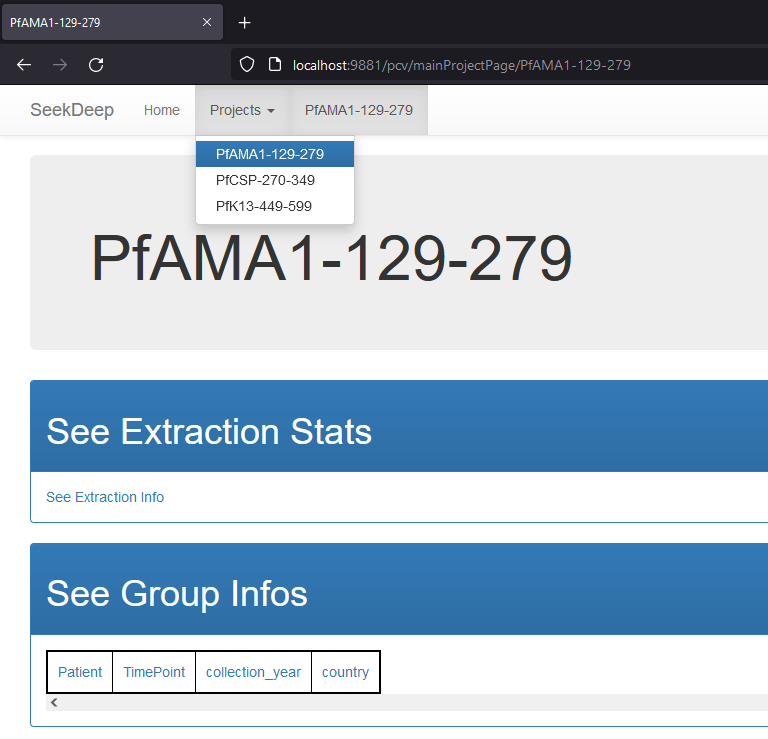

# Paired End no MIDs/Barcodes Tutorial
<p align="right"><b>Source:</b> https://seekdeep.brown.edu/tutorial_PairedEnd_noMIDs.html</p>

## Navigate to your Directory
```bash
cd ~/SeekDeep
```

## Get sample file (no replicates)
```bash
wget http://seekdeep.brown.edu/data/SeekDeepTutorialData/ver2_6_0/CamThaiGhanaDRC_2011_2013_drugRes_withRevComp.tar.gz --no-check-certificate 
tar -zxvf CamThaiGhanaDRC_2011_2013_drugRes_withRevComp.tar.gz

cd CamThaiGhanaDRC_2011_2013_drugRes_withRevComp
```

## Download genomes if they haven't been before
```bash
wget http://seekdeep.brown.edu/data/plasmodiumData/pfgenomes.tar.gz --no-check-certificate 
tar -zxvf pfgenomes.tar.gz

SeekDeep genTargetInfoFromGenomes --gffDir pfgenomes/info/gff --genomeDir pfgenomes/genomes/ --primers ids.tab.txt --numThreads 4 --pairedEndLength 250 --dout extractedRefSeqs
```

## Set up command
```bash
SeekDeep setupTarAmpAnalysis --samples sampleNames.tab.txt --outDir analysis --inputDir fastq/ --idFile ids.tab.txt --overlapStatusFnp extractedRefSeqs/forSeekDeep/overlapStatuses.txt --lenCutOffs extractedRefSeqs/forSeekDeep/lenCutOffs.txt --refSeqsDir extractedRefSeqs/forSeekDeep/refSeqs "--extraExtractorCmds=--checkRevComplementForPrimers" --groupMeta metaData.tab.txt

cd analysis
```

## Run analysis with whatever number of CPUs you want to use (below is 8)
```bash
./runAnalysis.sh 8
```

## Start data viewer
```bash
## ./startServerCmd.sh 9881 pcv
SeekDeep popClusteringViewer --verbose --configDir "$(pwd)/serverConfigs" --bindAddress 0.0.0.0 --port 9881 --name pcv
```
Then, navigate to [localhost](http://localhost:9881/pcv) on your local browser. You should then be able to see the viewer tool.


## Use Pipeline Wrapper
```
cd ..

SeekDeep setupTarAmpAnalysis --samples sampleNames.tab.txt --outDir analysis_output --inputDir fastq/ --idFile ids.tab.txt --overlapStatusFnp overlapStatuses.txt --lenCutOffs lenCutOffs.txt "--extraExtractorCmds=--checkRevComplementForPrimers" --groupMeta metaData.tab.txt
```

Results are in the `SeekDeep/CamThaiGhanaDRC_2011_2013_drugRes_withRevComp/analysis/popClustering/` folder where each directory is a gene. (e.g. `PfAMA1-129-279/analysis/selectedClustersInfo.tab.txt`)
