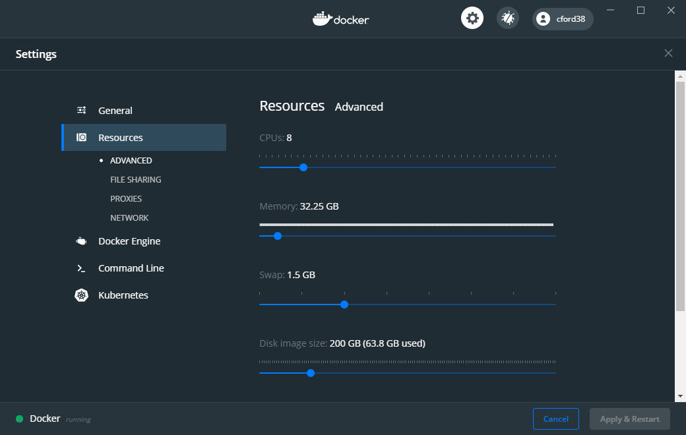

# Docker Image for SeekDeep
<h4 align = "right">Colby T. Ford, Ph.D.</h4>
This repository contains the Dockerfile for generating an Ubuntu image with SeekDeep pre-installed.

## DockerHub
This container image is available from DockerHub: [hub.docker.com/r/cford38/seekdeep](https://hub.docker.com/r/cford38/seekdeep)

#### Pull Image to Local Machine
```
docker pull cford38/seekdeep:latest
```
#### To Run Locally
```
docker run --name seekdeep -d cford38/seekdeep
docker exec -it seekdeep /bin/bash
```

#### Copy File to Container
```
docker cp myfile.txt seekdeep:./myfile.txt
```
-------------------------------

## Build Instructions
1. Clone this repository to your local machine

2. Open terminal and navigate to the directory of this repository.

3. Run the following command. This will generate the Docker image.
```
docker build -t seekdeep .
```
_Note:_ You may have to increase the resource limits in Docker's settings as this container size (and the resources SeekDeep needs to run) will be quite large.
<p align="center"></p>


4. Once the image has been created successfully, run the container using the following command.
```
docker run seekdeep
```

5. Once the container is ready, remote into the bash terminal.
```
docker run --name seekdeep -d seekdeep
docker exec -it seekdeep /bin/bash
```

----------------------

## To Publish on DockerHub

```
docker image tag seekdeep <USERNAME>/seekdeep
docker push <USERNAME>/seekdeep
```

----------------------
## About SeekDeep

SeekDeep, developed by the Bailey Lab at Brown University, is a suite of bioinformatics tools for analyzing targeted amplicon sequencing. Check out their website for more details: [http://seekdeep.brown.edu/](http://seekdeep.brown.edu/)
